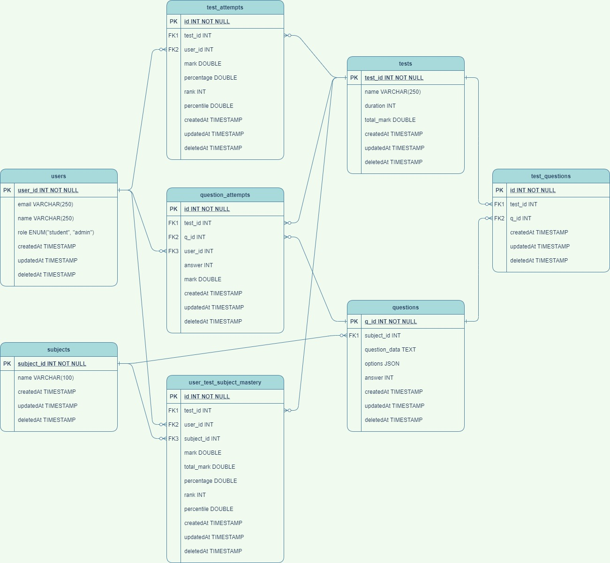

# Entrance Exam App

## Requirement:
1. Platform to conduct National wide entrance exam.
2. 1 - 2 Million users, so performance need to be given priority.
3. Test consists of MCQ questions.
4. Each question belongs to a Subject.
5. Each test can be configured with `n` number of questions.
6. Test duration is `n/10` hours by default and can be changed.
7. Correct: (`+10`) and Wrong: (`-3`)

### Problem 1:
User submissions are need to be stored in a efficient manner so it can handle large volume and compute question, test and subject level scores.

#### High level system design:

  

#### Database Schema:

  

### Problem 2:
Result are need to be published for all the exams conducted.
* Rank need to be computed.
* Percentile need to be calculated for each student in the test.
* Subject wise Percentile need to be calculated for each student in the test.

#### Prototype:
[Jupyter Notebook](prototype/results.ipynb)